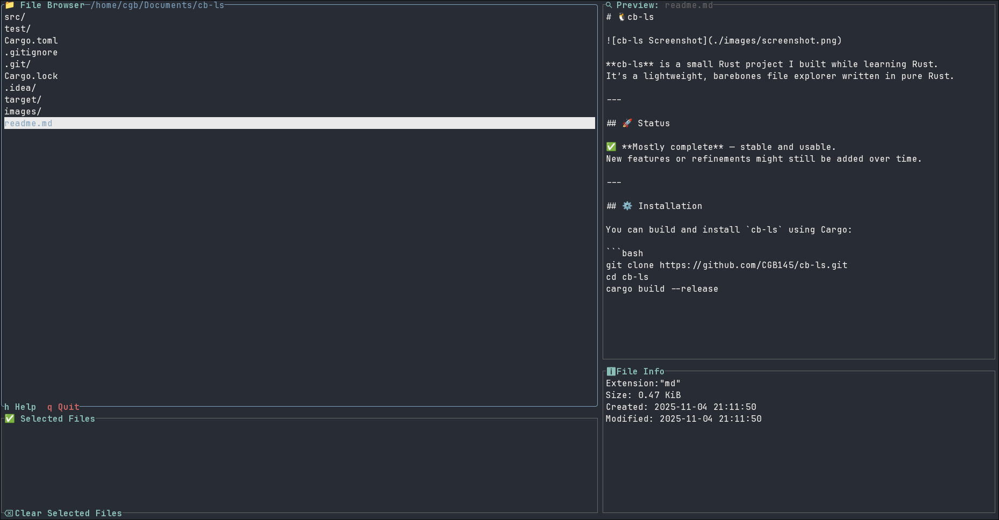

# 🦀 rustyFile



**rustyFile** is a small Rust project I built while learning Rust.  
It’s a lightweight, barebones file explorer written in pure Rust.

---

## 🚀 Status

✅ **Mostly complete** — stable and usable.  
New features or refinements might still be added over time.

---

## ⚙️ Installation

You can build and install `rustyFile` using Cargo:

```bash
git clone https://github.com/yourusername/rustyFile.git
cd rustyFile
cargo build --release
